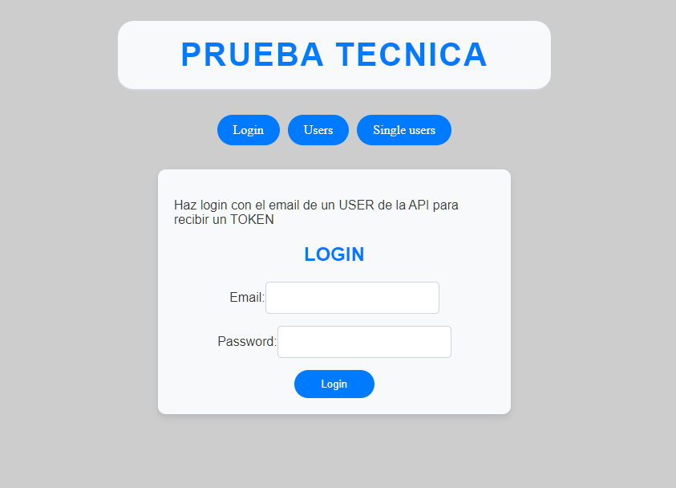

# Proyecto Angular

Este proyecto es una aplicación Angular que incluye componentes para el inicio de sesión de usuarios, la visualización de usuarios y la visualización de un solo usuario.
Empieza con una vista "Home" donde solo aparecen los tres botones "Login", "Users" y "Single users".

En Login podemos encontrar un formulario para loguearnos, deberemos introducir un email valido de la Api.

Si introducimos un email valido de la Api y una password y clickamos el boton "Login" nos aparecerá debajo el token que envia la Api como confirmación de que el usuario esta logueado correctamente.

Disponemos tambien de la posibilidad de listar todos los usuarios con el boton "Users", el cual si clickamos en el nos llevará a una nueva vista donde aparecerán todos los usuarios con su nombre y su fotografia o avatar, y un botón llamado "Detalles" en el cual si lo clickamos nos llevará a todos los datos de ese mismo usuario.

Por último, si pulsamos el botón "Single users" nos lleva a una vista donde nos pide una Id de usuario, por lo que si la ponemos nos lleva a una vista detallada también del usuario seleccionado, en la cual nos aparecerá todos los datos del usuario así como su fotografia o avatar.

## Componentes

El proyecto incluye los siguientes componentes:

- `LoginComponent`: Este componente se encarga del inicio de sesión de los usuarios. Al introducir un correo electrónico válido y una contraseña, se muestra un token debajo como resultado exitoso de la operación. El componente utiliza el servicio HttpClient para hacer solicitudes HTTP a una API y obtener los correos electrónicos de los usuarios. Los usuarios pueden iniciar sesión introduciendo su correo electrónico y contraseña. Si el inicio de sesión es correcto, se almacena un token en el almacenamiento local. Si el correo electrónico no está en la lista de correos electrónicos obtenidos de la API o si el correo electrónico o la contraseña están vacíos, se muestra un mensaje de error y se borra el token del almacenamiento local.

- `UsersComponent`: Este componente muestra la lista de todos los usuarios de la API con su nombre y fotografía. Cada fotografía de usuario tiene un botón de "Detalles" que permite acceder a todos los datos del usuario seleccionado.

- `SingleUserComponent`: Este componente permite buscar un usuario por su número de ID. Si se encuentra al usuario, todos sus datos se muestran en un modal.

## Instalación

Para instalar este proyecto, sigue estos pasos:

1. Clona el repositorio: `git clone https://github.com/Chichonicle/prueba-angular.git`
2. Navega al directorio del proyecto: `cd prueba-angular`
3. Instala las dependencias: `npm install`

## Uso

Para ejecutar este proyecto, usa el siguiente comando: `ng serve`. Luego, abre tu navegador y ve a `http://localhost:4200/`.

## Contribuir

Las contribuciones son bienvenidas. Para contribuir:

1. Haz un Fork del proyecto
2. Crea tu Feature Branch (`git checkout -b feature/AmazingFeature`)
3. Haz commit de tus cambios (`git commit -m 'Add some AmazingFeature'`)
4. Haz Push a la Branch (`git push origin feature/AmazingFeature`)
5. Abre un Pull Request

